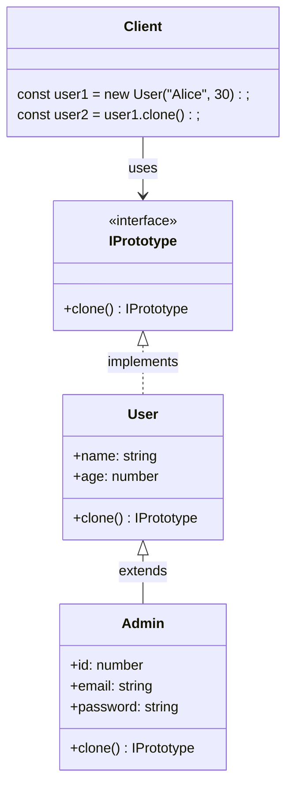

# Prototype Pattern

Allows to create / clone new objects out of existing objects instead of creating new objects

```mermaid
classDiagram

class IPrototype {
  <<interface>>
  +clone() IPrototype
}

class User {
  +name: string
  +age: number
  +clone() IPrototype
}

class Admin {
  +id: number
  +email: string
  +password: string
  +clone() IPrototype
}

class Client {
  const user1 = new User("Alice", 30);
  const user2 = user1.clone();
}

IPrototype <|.. User : implements
User <|-- Admin : extends

Client --> IPrototype : uses
```
